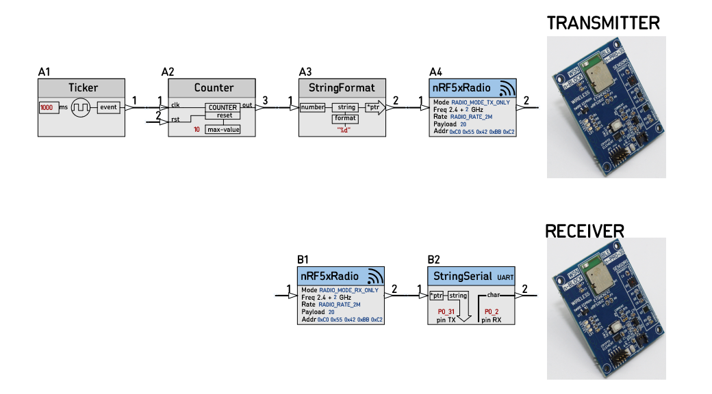
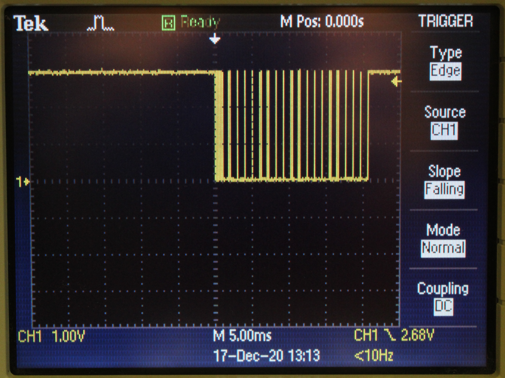

# SCHEMATIC_18D_radio_test

nBlocksStudio Design for NRF52832 Nordic proprietary protocol radio testing for Node [nRF5xRadio](https://github.com/nBlocksStudioNodes/nblocks_arrayvalue). Both Transmitter and Receiver boards are in a single Schematic Design.

----

Schematic nBlocksStudio Design, Tested with [n-PRO-30](https://www.n-blocks.net/nmodules/doku.php?id=nblocks:n-pro-30) n-Block :heavy_check_mark:

----

Signal at Receiver UART pin P0_31 is as expected, a new 9600-Baud_rate pulsetrain is received every sec :heavy_check_mark:

----